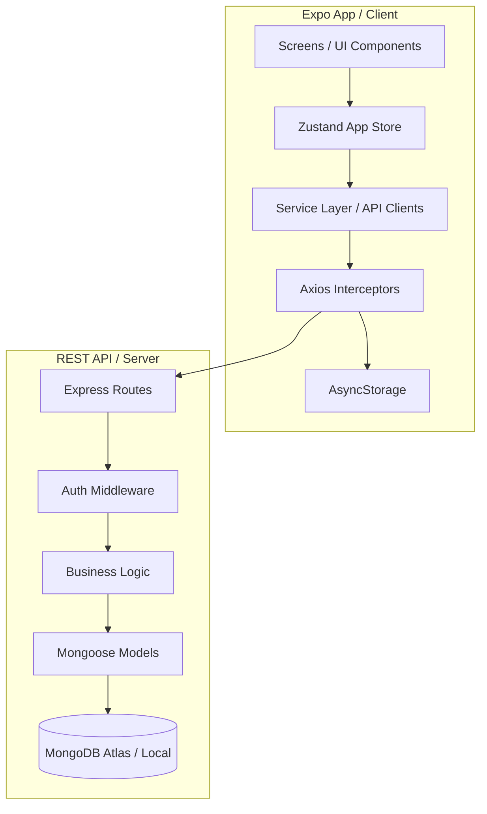

# MyLife — Premium Life Management Application

MyLife is a comprehensive, premium-grade life management ecosystem designed to organize daily life. Built as a universal mobile application using **React Native / Expo** with **TypeScript** on the frontend, and a **Node.js / Express / MongoDB** backend, MyLife integrates state management, notifications, and spouse account synchronization.

---

##  Technology Stack

### Frontend (Mobile App)
* **Core:** React Native (Expo SDK 54), TypeScript, React Native Reanimated.
* **Navigation:** File-based routing via `expo-router` with protected routes.
* **State Management:** `zustand` for high-performance, reactive global state.
* **Networking:** Axios with custom interceptors for JWT token lifecycle management (automatic header attachment and 401 intercept).
* **Local Storage:** `@react-native-async-storage/async-storage` for credentials and local fallback persistence.
* **System Integrations:** `expo-notifications` for background alerts and `expo-image-picker` for profile configurations.

### Backend (API Server)
* **Core Runtime:** Node.js with Express.js REST APIs.
* **Database:** MongoDB with Mongoose ODM schemas.
* **Security:** JWT authentication, bcryptjs hash validation, and `express-validator` request body parsing.
* **Real-time & Tooling:** Nodemon for server development auto-refresh.

---
##  Feature Modules

MyLife divides daily operations into 8 core modules:

1.  **Profile Management:** Set up a detailed user profile (avatar, name, email, phone, gender, and address) with local image selection.
2.  **Family Directory:** Manage family members, relationship status, and toggle automatic birthday reminder notifications scheduled 1 day before at 9:00 AM.
3.  **Shopping Lists:** Track "Today's Urgent Items" (with time alerts) and "Monthly Essentials" by categories (Groceries, Household, Medicine, etc.). Includes partner synchronization.
4.  **Health Suite:** Comprehensive medical logs including appointments, daily medicine schedules, health records (BP, blood sugar, weight, and automatic BMI calculations), and primary emergency contacts.
5.  **Utility Tracker:** Log utilities (electricity, water, internet) with due dates, payment status, recurring options, and automatic alerts before bills expire.
6.  **Finance Dashboard:** Premium, mobile-first design with a 4-zone balance card, visual category distribution, numpad-based custom transaction modal, and monthly ledger logging.
7.  **To-Do Checklist:** Prioritize tasks with due dates, custom reminders, and flexible recurrence configurations.
8.  **Future Events:** Log custom events and calendar notifications, check real-time count-down timers, and sync event schedules with your spouse.

###  Spouse Synchronization (Real-time Collaboration)
Accounts can be linked to sync shared resources (Shopping lists, Tasks, Utility bills, and Future events). Checking the **isShared** flag in the UI updates and displays data on both devices automatically.

---

##  Project Architecture



---

## 📁 Repository Directory Structure

```
mylife/
├── app/                      # Frontend App (Expo Router Screens)
│   ├── (tabs)/              # Core Dashboard and Tab Navigator
│   │   ├── index.tsx        # Main Dashboard Layout
│   │   └── _layout.tsx      # Tab Navigation Frame
│   ├── auth/                # Login & Registration Pages
│   ├── profile/             # Profile Configuration
│   ├── family/              # Family Directory UI
│   ├── shopping/            # Shopping list and toggle panel
│   ├── health/              # Medicine and Vitals tracker
│   ├── utility/             # Utility bills and indicators
│   ├── finance/             # Ledger and premium transaction modal
│   ├── todo/                # Tasks and checklists
│   └── future-event/        # Event planners and count-downs
├── backend/                  # REST API Backend Service
│   ├── middleware/          # JWT authorization layers
│   ├── models/              # MongoDB/Mongoose document schemas
│   ├── routes/              # Express API endpoint routers
│   ├── server.js            # Node backend app bootstrap
│   └── .env                 # Backend local environment keys
├── components/               # Shareable UI components & calendars
├── services/                 # Frontend API wrapper services
├── store/                    # Zustand store (`appStore.ts`)
├── types/                    # TypeScript model definitions (`index.ts`)
└── utils/                    # Common utils (API, Storage, Notifications)
```

---

##  Installation & Running Guide

### 1. Backend Server Setup
Navigate into the backend folder, configure configuration keys, and boot:

```bash
# Go to backend
cd backend

# Install dependencies
npm install

# Setup env variables (Create .env based on .env.example)
cp .env.example .env
```

Update the configuration file (`.env`):
```ini
PORT=5000
MONGODB_URI=mongodb://localhost:27017/mylife
JWT_SECRET=your_super_secure_key_here
```

Start the API:
```bash
# Run with nodemon auto-reload
npm run dev
```

The server launches at `http://localhost:5000`.

### 2. Frontend Expo Setup
Return to the project root directory, install React Native dependencies, and start Metro:

```bash
# Go back to root
cd ..

# Install dependencies
npm install

# Start the Expo Dev Server
npx expo start
```

Press:
* `a` to load on an Android Emulator
* `i` to load on an iOS Simulator
* Scan the QR Code using the **Expo Go** application (Android/iOS) to view the application on a physical device.

---

##  Security & Session Flow

1. **Authentication:** User logs in/registers under `/auth/login` or `/auth/register`. JWT token is saved locally to `AsyncStorage`.
2. **Auto-login:** On startup, the root `_layout.tsx` checks if a token is present, verifies it, and auto-navigates to `(tabs)`.
3. **Request Security:** API requests automatically attach the header `Authorization: Bearer <token>`.
4. **Expiry Interception:** If the server returns `401 Unauthorized` due to token expiration, the Axios client clears the store and routes the user back to the auth layout.

---

##  Development Reference Documents
* [INTEGRATION_COMPLETE.md](./INTEGRATION_COMPLETE.md) — Backend integration details.
* [PROGRESS.md](./PROGRESS.md) — Initial foundation project milestones.
